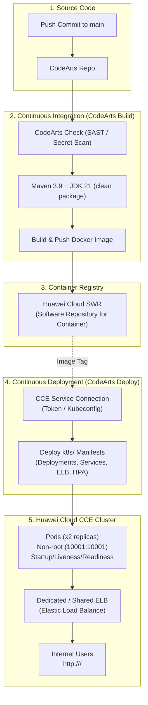

# Huawei Cloud & Huawei Cloud Stack (HCS) CCE Deployment Guide
## CodeArts Web Console GUI Step-by-Step Approach

This guide details the complete, visual **GUI-based approach** to building, containerizing, and deploying the **Age Calculator** application to **Huawei Cloud CCE (Cloud Container Engine)** / **Huawei Cloud Stack (HCS)** using **CodeArts** (CodeArts Repo, Check, Build, Deploy, and Pipeline).

---

## 1. End-to-End Architecture



---

## 2. Phase 1: Huawei Cloud / HCS Infrastructure Setup (Console GUI)

### Step 1.1: Create or Confirm CCE Cluster & Node Pool
1. Log in to the **Huawei Cloud Management Console** (or **HCS Manage** console).
2. In the Service List, select **Cloud Container Engine (CCE)**.
3. In the left navigation, click **Clusters** &rarr; **Create Cluster**:
   - **Cluster Type:** Select **CCE Standard Cluster** or **CCE Turbo Cluster**.
   - **Version:** v1.25, v1.27, or latest supported version.
   - **Network:** Select your existing VPC and Subnet (ensure NAT Gateway or EIP is attached if nodes need public internet access).
4. Under **Nodes / Node Pools**:
   - Create at least **1 or 2 ECS Worker Nodes** (recommended: 2 vCPU, 4GB RAM or higher, OS: *Huawei Cloud EulerOS* or *EulerOS*).
   - Ensure nodes reach `Running` status.

### Step 1.2: Create SWR Organization
1. From the Service List, open **Software Repository for Container (SWR)**.
2. In the left panel, select **Organization Management** &rarr; click **Create Organization**.
3. Enter an organization name:
   - Example: `devsecops-org`
4. Click **OK**.

### Step 1.3: Create Namespace in CCE Console
1. Return to the **CCE Console** &rarr; Click your cluster name.
2. In the left sidebar, navigate to **Namespaces** &rarr; click **Create Namespace**.
3. Enter:
   - **Name:** `age-calculator`
4. Click **OK**.

> [!NOTE]
> Huawei Cloud CCE automatically injects a secret named `default-secret` in every namespace containing authentication credentials for your account's regional SWR images.

---

## 3. Phase 2: Create CCE Service Connection in CodeArts (GUI)

To allow CodeArts to communicate with your CCE cluster:

1. Open **CodeArts** console &rarr; Select your project (e.g. `AgeCalculator-Project`).
2. At the top right or bottom left, click **Project Settings** (gear icon) &rarr; **Service Endpoints** (or **External Connections**).
3. Click **Create Service Endpoint** &rarr; Choose **Kubernetes (CCE)**.
4. Fill in the modal fields:
   - **Endpoint Name:** `cce-prod-connection`
   - **Connection Mode:**
     - **Cluster Token Mode:** Select your Huawei Cloud Region &rarr; Select your CCE Cluster from the dropdown list.
     - *Or* **KubeConfig Mode:** Copy and paste the KubeConfig downloaded from the CCE cluster details page.
5. Click **Test Connectivity**. When the green badge shows `Connection successful`, click **Authorize and Save**.

---

## 4. Phase 3: Configure CodeArts Build Task (GUI)

1. In CodeArts, navigate to **CI/CD** &rarr; **CodeArts Build**.
2. Click **Create Task** &rarr; Choose **Custom Template** (or start from a blank canvas).
3. Fill in basic information:
   - **Task Name:** `build-age-calculator`
   - **Code Repository:** Select `age-calculator`
   - **Branch:** `main`

### Step 4.1: Add Action - Maven Build
Click **Add Step** &rarr; Search and select **Build with Maven**:
- **Tool Version:** `OpenJDK 21` and `Maven 3.9`
- **Command Window:**
  ```bash
  mvn clean package -DskipTests=false
  ```
- **Test Results Parsing:** Toggle switch to `Enabled` (Pattern: `**/surefire-reports/*.xml`).

### Step 4.2: Add Action - Build and Push Image to SWR
Click **Add Step** &rarr; Search and select **"Build an Image and Push It to SWR"** (or **"Docker Build and Push"**):
- **SWR Connection:** Select `Current Account / Integrated SWR`.
- **Organization Name:** Select `devsecops-org` (from dropdown).
- **Image Name:** `age-calculator`.
- **Image Tag:** `${BUILD_NUMBER}`.
- **Also Push as Latest:** Check the box ✅ `true`.
- **Context Directory:** `.` (dot, representing the root directory).
- **Dockerfile Path:** `./Dockerfile`.
- Click **Save**.

---

## 5. Phase 4: Configure CodeArts Deploy Task (GUI)

1. In CodeArts, navigate to **CI/CD** &rarr; **CodeArts Deploy**.
2. Click **Create Task** &rarr; Select **Kubernetes (CCE)** template (or Blank Task).
3. Set **Task Name:** `deploy-age-calculator-to-cce`.

### Option A: Using the Native CCE Deploy GUI Step (Recommended)
1. In the task canvas, add the step **"Deploy Kubernetes Manifests"** (or **"Kubernetes Deployment"**).
2. Configure the following fields in the GUI form:
   - **Kubernetes Endpoint:** Select `cce-prod-connection`.
   - **Namespace:** Select or type `age-calculator`.
   - **Manifest Source:** Select **Repository Code**.
   - **File / Directory Path:** `k8s/`
   - **Image Replacement Rule:**
     - Click **+ Add Replacement**:
       - **Target Placeholder Image:**
         `swr.ap-southeast-3.myhuaweicloud.com/devsecops-org/age-calculator:latest`
       - **Replacement Image:**
         `swr.${SWR_REGION}.myhuaweicloud.com/${SWR_ORG}/age-calculator:${BUILD_NUMBER}`
   - **Rollout Timeout:** `180` seconds.

### Option B: Using the Bash Automation Step (`deploy.sh`)
Alternatively, if using the shell execution runner in CodeArts Deploy:
1. Add step **Execute Shell Command**:
2. Set the shell script:
   ```bash
   export SWR_REGION="ap-southeast-3"
   export SWR_ORG="devsecops-org"
   export IMAGE_TAG="${BUILD_NUMBER}"
   export NAMESPACE="age-calculator"
   
   chmod +x ./k8s/deploy.sh
   ./k8s/deploy.sh
   ```
3. Click **Save**.

---

## 6. Phase 5: Assemble the Visual CodeArts Pipeline (GUI)

Tie Code Quality, CI Build, SWR Push, and CCE Deploy together into an automated pipeline.

1. Navigate to **CI/CD** &rarr; **CodeArts Pipeline**.
2. Click **Create Pipeline** &rarr; Select **Blank Template**.
3. Set **Pipeline Name:** `age-calculator-ci-cd-pipeline`.

### Stage 1: Security & Quality Check
1. Click **+ Add Stage** &rarr; Name it `Security & Code Quality`.
2. Click **+ Add Task** inside this stage:
   - Select **CodeArts Check**.
   - Select Task: your configured CodeArts Check task (`Java Standard Ruleset` + `OWASP Top 10`).
   - Set Quality Gate: Block pipeline if `Critical > 0`.

### Stage 2: Build & Push Container
1. Click **+ Add Stage** &rarr; Name it `Build & Containerize`.
2. Click **+ Add Task** inside this stage:
   - Select **CodeArts Build**.
   - Select Task: `build-age-calculator`.

### Stage 3: Deploy to Huawei Cloud CCE
1. Click **+ Add Stage** &rarr; Name it `Deploy to Production CCE`.
2. Click **+ Add Task** inside this stage:
   - Select **CodeArts Deploy**.
   - Select Task: `deploy-age-calculator-to-cce`.

### Configure Pipeline Variables & Triggers
1. Switch to the **Variables** tab at the top:
   - Add `SWR_REGION` = `ap-southeast-3` (or your active region)
   - Add `SWR_ORG` = `devsecops-org`
2. Switch to the **Triggers** tab:
   - Check **Code Commit Trigger** ✅.
   - Select Branch: `main`.
   - Event: `Push`.
3. Click **Save and Run**.

---

## 7. Phase 6: Verifying CCE Deployment & Accessing the App (GUI)

Once the CodeArts Pipeline finishes with all green checkmarks:

### 1. View Pods & Workload in CCE Console
1. Navigate to **Huawei Cloud Console** &rarr; **Cloud Container Engine (CCE)**.
2. Select your cluster &rarr; Go to **Workloads** &rarr; **Deployments**.
3. Select namespace `age-calculator`.
4. You will see `age-calculator-deployment`:
   - **Status:** `Running` (Green).
   - **Pods:** `2/2 Ready`.
5. Click on `age-calculator-deployment` &rarr; Go to **Pods** tab to inspect:
   - Real-time CPU & Memory consumption.
   - Container logs (click **View Logs** next to any running pod).

### 2. View Huawei Cloud ELB Public IP
1. In CCE left navigation, go to **Networking** &rarr; **Services**.
2. Select namespace `age-calculator`.
3. Find `age-calculator-elb-service`:
   - **Type:** `LoadBalancer`.
   - **External IP / Access Address:** Shows the automatically provisioned Huawei Cloud Elastic IP (EIP) or ELB domain, e.g.:
     `119.8.x.x:80`
4. Click or copy the IP address.

### 3. Test Application in Browser & Health Check
Open your web browser and navigate to:
```text
http://<EXTERNAL-IP>/
```
You will see the **Age Calculator** interactive web application.

To verify the container health probe endpoint:
```text
http://<EXTERNAL-IP>/api/health
```
Expected JSON output:
```json
{
  "service": "age-calculator",
  "status": "UP"
}
```

---

## 8. Phase 7: One-Click Rollback in CCE Console (GUI)

If an issue occurs after a release:

1. Open **CCE Console** &rarr; **Workloads** &rarr; **Deployments**.
2. Select `age-calculator-deployment`.
3. In the upper right corner or under **Operation**, click **More** &rarr; **Roll Back**.
4. Select the previous stable revision from the revision list.
5. Click **OK**. CCE will perform a rolling replacement back to the previous stable pods with zero downtime.

---

## 9. Manifests Reference Matrix

All Kubernetes manifests used by CodeArts Deploy are located in the [k8s/](file:///c:/Users/SystemBus/Desktop/agecalculator%20java/k8s) folder:

| File | Purpose |
| :--- | :--- |
| [k8s/00-namespace.yaml](file:///c:/Users/SystemBus/Desktop/agecalculator%20java/k8s/00-namespace.yaml) | Defines the isolated `age-calculator` namespace |
| [k8s/01-configmap.yaml](file:///c:/Users/SystemBus/Desktop/agecalculator%20java/k8s/01-configmap.yaml) | Production JVM arguments and profile configurations |
| [k8s/02-deployment.yaml](file:///c:/Users/SystemBus/Desktop/agecalculator%20java/k8s/02-deployment.yaml) | 2 replicas, rolling updates, security context (`10001:10001`), startup/liveness/readiness probes |
| [k8s/03-service.yaml](file:///c:/Users/SystemBus/Desktop/agecalculator%20java/k8s/03-service.yaml) | ClusterIP service for internal network routing |
| [k8s/03-service-elb.yaml](file:///c:/Users/SystemBus/Desktop/agecalculator%20java/k8s/03-service-elb.yaml) | Automatically provisions Huawei Cloud Elastic Load Balancer (ELB) with EIP |
| [k8s/04-ingress.yaml](file:///c:/Users/SystemBus/Desktop/agecalculator%20java/k8s/04-ingress.yaml) | Huawei CCE Ingress routing rules |
| [k8s/05-hpa.yaml](file:///c:/Users/SystemBus/Desktop/agecalculator%20java/k8s/05-hpa.yaml) | Autoscaler scaling between 2 and 10 pods based on resource load |
| [k8s/06-pdb.yaml](file:///c:/Users/SystemBus/Desktop/agecalculator%20java/k8s/06-pdb.yaml) | Prevents outages during cluster node upgrades / draining |
| [k8s/kustomization.yaml](file:///c:/Users/SystemBus/Desktop/agecalculator%20java/k8s/kustomization.yaml) | Kustomize bundling for all manifests |
| [k8s/deploy.sh](file:///c:/Users/SystemBus/Desktop/agecalculator%20java/k8s/deploy.sh) | Executable bash deployment script for shell runners |
