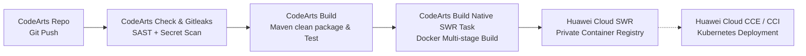

# Huawei Cloud CodeArts DevSecOps CI/CD Pipeline Guide

This guide provides end-to-end instructions for deploying the **Age Calculator** Single Page Application using **Huawei Cloud CodeArts** and **Huawei Cloud SWR (Software Repository for Container)**.

---

## 1. Architecture & Pipeline Workflow



---

## 2. Prerequisites on Huawei Cloud

1. **Huawei Cloud Account & IAM:**
   - Ensure your IAM user has permissions for **CodeArts** (Project Manager or Developer role) and **SWR** (Admin or Editor).
2. **Create SWR Organization:**
   - Navigate to the **Huawei Cloud Management Console** &rarr; Search for **Software Repository for Container (SWR)**.
   - In the left sidebar, click **Organization Management** &rarr; **Create Organization**.
   - Name your organization (e.g., `devsecops-org`).
   - Note your regional SWR endpoint:
     - *AP-Singapore:* `swr.ap-southeast-3.myhuaweicloud.com`
     - *CN-Hong Kong:* `swr.ap-southeast-1.myhuaweicloud.com`
     - *CN-North-Beijing4:* `swr.cn-north-4.myhuaweicloud.com`
     - *EU-Paris / Johannesburg / Santiago:* Check your active region endpoint.

---

## 3. Step-by-Step CodeArts GUI Configuration

### Step 1: Push Code to CodeArts Repo
1. Open **CodeArts** console &rarr; Select or create a project (e.g., `AgeCalculator-Project`).
2. Go to **Code** &rarr; **CodeArts Repo**.
3. Click **Create Repository** (or **Import Repository** from GitHub/GitLab).
4. Push this repository codebase into the `main` branch:
   ```bash
   git init
   git add .
   git commit -m "feat: initial commit with Spring Boot SPA and Dockerfile"
   git remote add origin <YOUR_CODEARTS_REPO_HTTPS_URL>
   git push -u origin main
   ```

---

### Step 2: Configure CodeArts Check (SAST & Secret Detection)
Huawei Cloud provides native **CodeArts Check** for deep code quality, security rulesets, and vulnerability detection.

1. In your CodeArts project, go to **Code** &rarr; **CodeArts Check**.
2. Click **Create Task** &rarr; Select your repository (`age-calculator`) and branch (`main`).
3. Under **Rule Sets**:
   - Check **Java Standard Ruleset** and **OWASP Top 10 Security Ruleset**.
4. To integrate **Gitleaks** (Secrets Scanning) and custom **Semgrep** rules:
   - In CodeArts Build (described below), you can also execute a security script task before compilation.

---

### Step 3: Configure CodeArts Build Task
Navigate to **CI/CD** &rarr; **CodeArts Build** &rarr; Click **Create Task**.
Select **Custom Template** or **Maven Template**.

#### Substep 3.1: Code Checkout
- The checkout step is automatically added by CodeArts Build when bound to the repository and branch `main`.

#### Substep 3.2: Security & Secret Scanning (Shell Task)
Add an action: **Execute Shell Command**:
```bash
echo "=== Step 2.1: Running Gitleaks Secrets Scanning ==="
# Download and execute gitleaks binary
wget -q https://github.com/gitleaks/gitleaks/releases/download/v8.18.2/gitleaks_8.18.2_linux_x64.tar.gz
tar -xzf gitleaks_8.18.2_linux_x64.tar.gz
./gitleaks detect --source=. --config=.gitleaks.toml --verbose --redact

echo "=== Step 2.2: Running SAST Check ==="
echo "CodeArts Check executes natively via CodeArts Check task, or run Semgrep via CLI"
```

#### Substep 3.3: Maven Compilation & Unit Testing
Add the native action: **Build with Maven**:
- **Tool Version:** `Maven 3.9` & `OpenJDK 21` (or `OpenJDK 17`).
- **Command:**
  ```bash
  mvn clean package -DskipTests=false
  ```
- **Settings:** Use the default or enterprise internal mirror settings.
- **Unit Test Coverage:** Toggle **Enable Test Results Parsing** (pattern: `**/surefire-reports/*.xml`).

---

### Step 4: Docker Build & Push to Huawei Cloud SWR
In CodeArts Build, add the official native task: **"Build an Image and Push It to SWR"** (or **"Docker Build and Push"**).

Fill in the task GUI fields:
1. **Docker Connection / Authentication:**
   - Select **Current Account / Integrated Service Endpoint** (CodeArts automatically authenticates to your SWR in the same region without hardcoding passwords).
2. **Organization Name:**
   - Select the organization you created in SWR (e.g., `devsecops-org`).
3. **Image Name:**
   - Set to `age-calculator`.
4. **Image Tag:**
   - Set to `${BUILD_NUMBER}` (or `${BUILD_TAG}`).
   - Check **Also push as `latest` tag**.
5. **Context Path:**
   - Set to `.` (workspace root).
6. **Dockerfile Path:**
   - Set to `./Dockerfile`.

---

## 4. Complete CodeArts Build Configuration (`build.yml`)

For teams using Configuration-as-Code in Huawei Cloud CodeArts, you can save this configuration as the pipeline build definition:

```yaml
version: "2.0"
steps:
  - name: Code Checkout
    action: checkout
    inputs:
      scm: codearts_repo
      branch: main

  - name: Secret Scan (Gitleaks)
    action: shell
    inputs:
      commands:
        - wget -q https://github.com/gitleaks/gitleaks/releases/download/v8.18.2/gitleaks_8.18.2_linux_x64.tar.gz
        - tar -xzf gitleaks_8.18.2_linux_x64.tar.gz
        - ./gitleaks detect --source=. --config=.gitleaks.toml --verbose

  - name: Maven Build & Unit Test
    action: maven
    inputs:
      jdk_version: "21"
      maven_version: "3.9"
      commands:
        - mvn clean package -DskipTests=false

  - name: Build and Push Docker Image to SWR
    action: swr_push
    inputs:
      swr_organization: "devsecops-org"
      image_name: "age-calculator"
      image_tag: "${BUILD_NUMBER}"
      dockerfile_path: "./Dockerfile"
      context_path: "."
      push_latest: true
```

---

## 5. Setting up the Full CodeArts Pipeline (Visual Orchestration)

To tie **CodeArts Check**, **CodeArts Build**, and notifications together:

1. In CodeArts, navigate to **CI/CD** &rarr; **CodeArts Pipeline**.
2. Click **Create Pipeline** &rarr; **Blank Template**.
3. Define the stages:
   - **Stage 1 (Code Quality & Security):** Add task &rarr; **CodeArts Check**. Set quality gate to block pipeline on Critical issues.
   - **Stage 2 (CI Build & Registry Push):** Add task &rarr; Link the **CodeArts Build Task** created in Step 3.
   - **Stage 3 (Deploy - Optional):** Add task &rarr; Deploy to **Huawei Cloud CCE (Cloud Container Engine)** or **CCI (Cloud Container Instance)** using the SWR image tag `${BUILD_NUMBER}`.
4. Set **Triggers**:
   - Check **Code Commit Trigger** on branch `main` to achieve true continuous integration.

---

## 6. SWR Verification & Image Pull Verification

Once the pipeline execution passes successfully:
1. Go to **SWR Console** &rarr; **My Images** &rarr; Select `devsecops-org/age-calculator`.
2. Verify the newly pushed tag `${BUILD_NUMBER}` and `latest`.
3. You can pull and run the verified container on any Docker host or ECS:
   ```bash
   # Log in to your regional SWR
   docker login -u <REGION>@<USER_NAME> -p <LOGIN_KEY> swr.<REGION>.myhuaweicloud.com

   # Run container
   docker run -d -p 8080:8080 --name age-calc swr.<REGION>.myhuaweicloud.com/<ORG>/age-calculator:latest
   ```
4. Access the web app in your browser at `http://<HOST_IP>:8080`.
